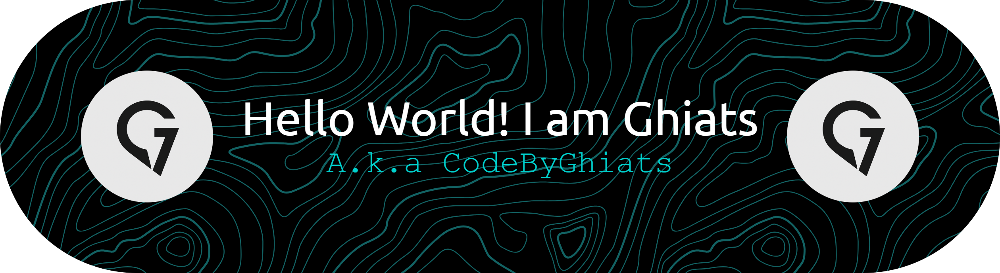

 

- 🌱 I’m currently learning: Laravel & Node.js to strengthen my full-stack skills  
- 👯 I’m looking to collaborate on: Frontend projects with stunning UI/UX  
- 🤔 I’m looking for help with: Advanced backend integration for frontend-heavy apps  
- 💬 Ask me about: HTML, CSS, JavaScript, PHP, MySQL, C#, C++
- ⚡ Fun fact: I love turning complex ideas into clean, beautiful user interfaces ✨ 

## 💻 Tech Stack:

## 🌐 Socials:

  

## 📊 GitHub Stats:

<!-- # 💫 About Me:
- 🌱 I’m currently learning: Laravel & Node.js to strengthen my full-stack skills   - 👯 I’m looking to collaborate on: Frontend projects with stunning UI/UX   - 🤔 I’m looking for help with: Advanced backend integration for frontend-heavy apps   - 💬 Ask me about: HTML, CSS, JavaScript, PHP, MySQL, C#, C++ - ⚡ Fun fact: I love turning complex ideas into clean, beautiful user interfaces ✨  -->

<!-- ## 🌐 Socials:
   

# 💻 Tech Stack:
       
# 📊 GitHub Stats:
  -->
 

## 🏆 GitHub Trophies

### 🔝 Top Contributed Repo

---

<picture>
  <source media="(prefers-color-scheme: dark)" srcset="https://raw.githubusercontent.com/codebyghiats/codebyghiats/output/pacman-contribution-graph-dark.svg">
  <source media="(prefers-color-scheme: light)" srcset="https://raw.githubusercontent.com/codebyghiats/codebyghiats/output/pacman-contribution-graph.svg">
  
</picture>

###
<!-- Proudly created with GPRM ( https://gprm.itsvg.in ) -->